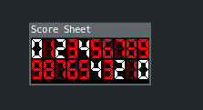
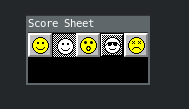
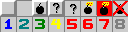
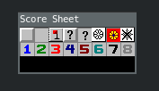

[](https://dev.azure.com/andreasisnes/Elitekollektivet/_build/latest?definitionId=12&branchName=master)
[](https://pypi.org/project/pygame-minesweeper-sprites/)

# Introduction
A sprite sheet is an image that consists of several smaller images (sprites) and/or animations. Combining the small images in one big image improves the game performance, reduces the memory usage and speeds up the startup time of the game.

This repository contains a python pygame library for easy loading of various sprite sheets from the game minesweeper.

# Getting Started

## Installation

```bash
python3 -m pip install pygame-minesweeper-sprites
# or
pip install pygame-minesweeper-sprites
```

## General
There are three types of sprite sheets *score*, *face*, and *tile*. Each type of sheet has there own set of different themes, look at the tables below.

## Score
These two *score* sprite sheets have the same dimension 130 x 23. A single-digit image has a dimension of 13 x 23.
| Spritesheet | Name |
| -------| ----|
| | two_thousand |
| | monochrome |

### Usage
```python
from minesweeper import sprites
import pygame

def view_scores(screen):
    monochrome = sprites.ScoreSheets(sprites.ScoreSheets.monochrome)

    builder = sprites.ScoreBuilder() # kwarg: sheet=two_thousand
    score = builder.zero(monochrome).two(monochrome).four(monochrome).build()

    screen.blit(score.zero, (13 * 0, 0))
    screen.blit(score.one, (13 * 1, 0))
    screen.blit(score.two, (13 * 2, 0))
    screen.blit(score.three, (13 * 3, 0))
    screen.blit(score.four, (13 * 4, 0))
    screen.blit(score.five, (13 * 5, 0))
    screen.blit(score.six, (13 * 6, 0))
    screen.blit(score.seven, (13 * 7, 0))
    screen.blit(score.eight, (13 * 8, 0))
    screen.blit(score.nine, (13 * 9, 0))

    tiles = score["9876543210"]
    [screen.blit(tile, (13 * idx, 23)) for idx, tile in enumerate(tiles)]

    pygame.display.update()

if __name__ == "__main__":
    pygame.init()
    pygame.display.set_caption("Score Sheet")
    screen = pygame.display.set_mode((130, 23 * 2))
    view_scores(screen)
```
Three classes are used. The ScoreSheet, ScoreBuilder and lastly the Score. You don't initialize the Score class directly the Builder class generate an instance of this class for you by calling the method *build*. A classic builder pattern. Every builder class default to *two_thousand* unless you specify otherwise this can be done by overriding the key-word argument *sheet* like this.

```python
def view_scores():
    builder = sprites.ScoreBuilder(sheet=sprites.ScoreSheets(sprites.ScoreSheets.monochrome))
```
The sheet you pass to the constructor will be applied for every sprite, but it is possible to mix sheets by calling the setter methods, the setter methods will always return self so it easy to nest method calls.

```python
builder.zero(monochrome).two(monochrome).four(monochrome).build()
```
After calling build you can simply access the properties in order to fetch an image. It will be returned as a pygame surface. You can also index the Score class with any sequence of numbers or string and it will always return a list of pygame surfaces like shown above.

The result from the code snippet above.




## Smiley Face
These two smile face sprite sheets have the same dimension 120 x 24. A face has a dimension of 24 x 24.
| Spritesheet | Name |
| -------| ----|
| | two_thousand |
| | monochrome |

### Usage
```python
from minesweeper import sprites
import pygame

def view_faces(screen):
    two_thousand = sprites.FaceSheets(sprites.FaceSheets.two_thousand)

    builder = sprites.FaceBuilder(sprites.FaceSheets(sprites.FaceSheets.monochrome))
    builder.excited(two_thousand).dead(two_thousand).smile(two_thousand).build()
    face = builder.build()
    
    screen.blit(face.smile, (24 * 0, 0))
    screen.blit(face.smile_click, (24 * 1, 0))
    screen.blit(face.excited, (24 * 2, 0))
    screen.blit(face.winner, (24 * 3, 0))
    screen.blit(face.dead, (24 * 4, 0))
    
    pygame.display.update()

if __name__ == "__main__":
    pygame.init()
    pygame.display.set_caption("Score Sheet")
    screen = pygame.display.set_mode((120, 24))
    view_faces(screen)
```

The same pattern applies here as above, we have a FaceSheet class and a builder Class. By calling the build method in the builder class we generate a sprite sheet class that only contains the needed and specified surfaces from the builder class.



## Tiles
These tile sprite sheets have the same dimension 128 x 32. A single tile has the dimension 16 x 16.
| Spritesheet | Name |
| -------| ----|
| | two |
| | two_nine |
| | ninety_five |
| | two_thousand |
| | fiorito_two_thousand |
| | fiorito_xp |
| | fiorito_monochrome |
| | monochrome |

### Usage
```python
from minesweeper import sprites
import pygame

two = sprites.TileSheets(sprites.TileSheets.two_thousand)
two_nine = sprites.TileSheets(sprites.TileSheets.two_nine)
ninety_five = sprites.TileSheets(sprites.TileSheets.ninety_five)
two_thousand = sprites.TileSheets(sprites.TileSheets.two_thousand)
fiorito_two_thousand = sprites.TileSheets(sprites.TileSheets.fiorito_two_thousand)
fiorito_monochrome = sprites.TileSheets(sprites.TileSheets.fiorito_monochrome)
fiorito_xp = sprites.TileSheets(sprites.TileSheets.fiorito_xp)
monochrome = sprites.TileSheets(sprites.TileSheets.monochrome)

def view_tiles(screen):
    blit = lambda img, idx, row: screen.blit(img, (16 * idx, row * 16))
    builder = sprites.TileBuilder(two)
    builder.unopened(two).empty(two_nine).flag(ninety_five)
    builder.question_mark(two_thousand).question_mark_click(fiorito_two_thousand)
    builder.mine(fiorito_monochrome).mine_red(fiorito_xp).mine_red_cross(monochrome)
    tile = builder.build()

    blit(tile.unopened, 0, 0)
    blit(tile.empty, 1, 0)
    blit(tile.flag, 2, 0)
    blit(tile.question_mark, 3, 0)
    blit(tile.question_mark_click, 4, 0)
    blit(tile.mine, 5, 0)
    blit(tile.mine_red, 6, 0)
    blit(tile.mine_red_cross, 7, 0)

    blit(tile[1], 0, 1)
    blit(tile["2"], 1, 1)
    blit(tile.three, 2, 1)
    blit(tile[4], 3, 1)
    blit(tile["5"], 4, 1)
    blit(tile.six, 5, 1)
    blit(tile[7], 6, 1)
    blit(tile["8"], 7, 1)

    pygame.display.update()

if __name__ == "__main__":
    pygame.init()
    pygame.display.set_caption("Score Sheet")
    screen = pygame.display.set_mode((128, 32))
    view_tiles(screen)
```

Same pattern applies here as the others, it also possible to index the class with number 0 or string "0", it will return *tile.empty*.



# Credits

The sprites used in this project were created by [Black Squirrel](https://www.spriters-resource.com/submitter/Black+Squirrel/), TCRF, Inky and DaSpriter121. The sheet can be found [here.](https://www.spriters-resource.com/pc_computer/minesweeper/sheet/19849/)


